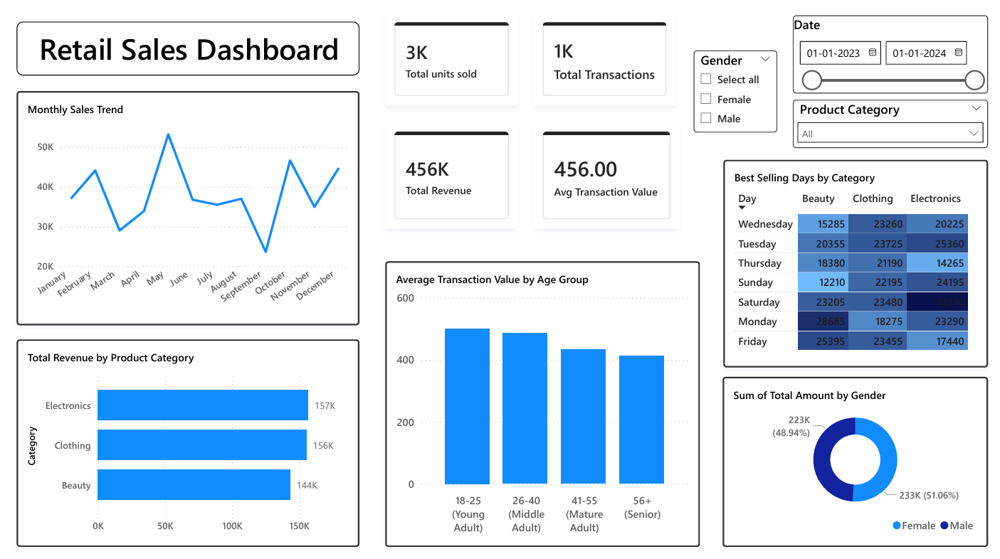

# Retail Sales Analysis & Power BI Dashboard

## 📌 Project Overview
An analysis of retail transaction data to identify key sales trends, top-performing product categories, and high-value customer segments. 

## 🛠️ Tools Used
- **Python:** Data cleaning and Exploratory Data Analysis (EDA).
- **Pandas/Matplotlib/Seaborn:** Data manipulation and visualization.
- **Power BI:** Dynamic dashboarding and KPI tracking.

## 📊 Key Insights
- **Insight: Sales peak significantly in May (Annual High) and during the Q4 Holiday season (Oct–Dec).
Recommendation: Align inventory procurement to ensure peak stock levels by April 15th and September 15th.
- **Insight: Electronics is the "Hero" category, generating $156,905 in revenue with the highest price-per-unit efficiency.
Recommendation: Protect margins on Electronics while using "Premium Clothing" lines to up-sell the high-volume clothing segment.
- **Insight: The 26–40 demographic provides the most consistent high-value returns with an ATV of ~$494.
Recommendation: Focus 60% of digital marketing spend on platforms catering to young professionals (Instagram/LinkedIn).
- **Insight: Electronics shopping is Saturday-heavy.
Recommendation: Launch "Weekend Tech Flash Sales" starting Friday evenings to capture the Saturday surge.

## 🖼️ Dashboard Preview

## 📂 Project Structure
- `task1.ipynb`
- `retail_sales_dataset.csv`
- `task1` (power bi file)
## 📂 Project Structure
- `task1.ipynb`: Cleaning, EDA, and Visualization.
- `retail_sales_dataset.csv`: The source dataset from Kaggle.
- `Retail_Sales_Dashboard.pbix`: Power BI file with interactive slicers.
- `retail_dashboard.png`: A high-resolution preview of the final report.
